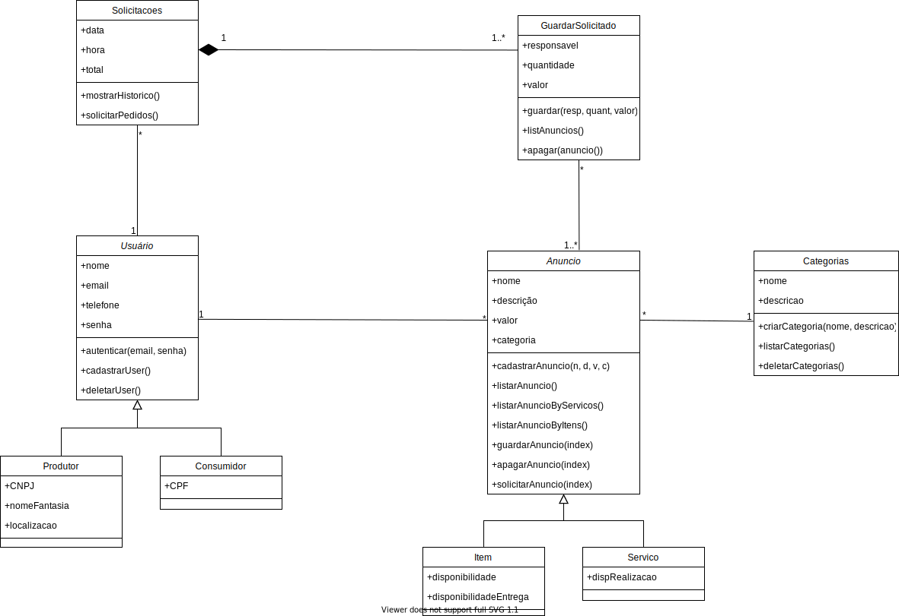
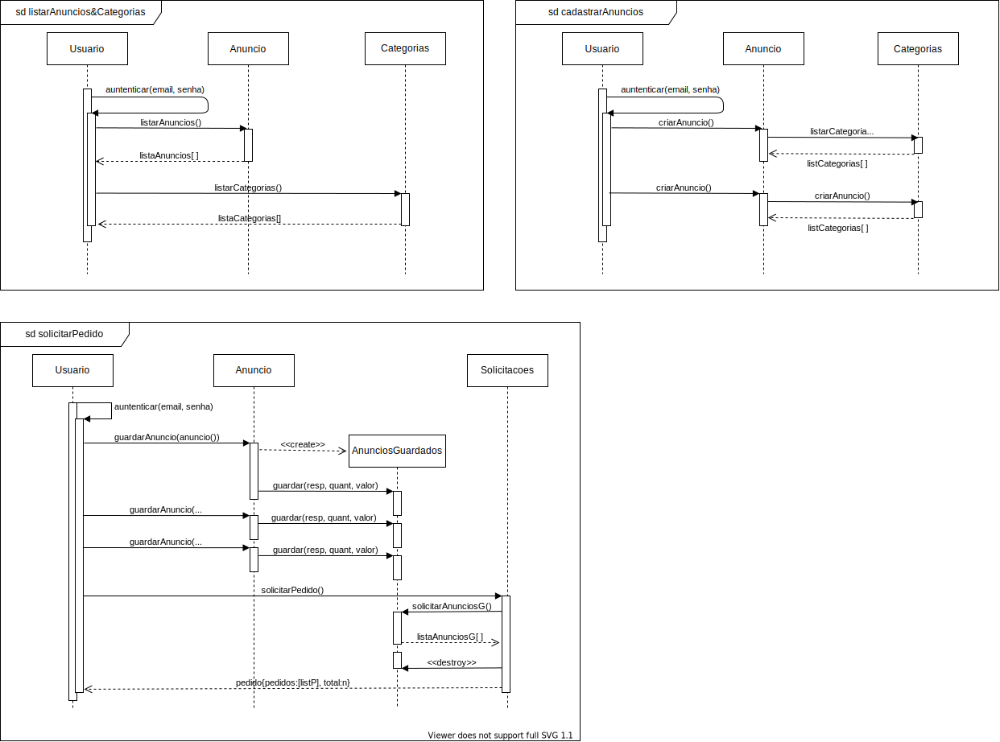

# Car Shop Services
O Car Shop Services é um projeto desenvolvido junto a disciplina Projeto e Desenvolvimento de Software (PDS), que visa criar uma aplicação WEB para a realização e oferecimento de itens e serviços do ramo automotivo, buscando melhorar e facilitar a demanda dos usuários especialistas na área ou até mesmo dos que desejam apenas uma rápida troca dos pneus.

Neste repositório se encontra apenas o frontend da aplicação, o backen está localizado em [Car Shop Services API](https://github.com/ecpandrew/car-shop-api.git).

## Diagrama de Casos de Uso

### Casos de uso Implementados

- [X] Cadastrar Usuário (Front & Back)
- [X] Autenticar Usuário (Front & Back)
- [X] Gerenciar Categorias (Back)
    - [X] Adicionar Categoria (Back)
    - [X] Remover Categoria (Back)
    ##### _Obs: A Gerencia de Categoria deve ficar só no back_
- [X] Listar Categorias (Front & Back)
- [X] Guardar Anúncios (Back)
    - [X] Listar Anúncios Guardados (Back)
    - [X] Apagar Anúncio Guardado (Back)
- [X] Gerenciar Solicitações (Back)
    - [X] Solicitar Anúncios Guardados (Back)
    - [X] Exibir Histórico de Solicitações (Back)
- [X] Listar Anúncios (Front & Back)
    - [X] Listar por Item (Front & Back)
    - [X] Listar por Serviços (Front & Back)
- [X] Cadastrar Anúncio (Front & Back)

## Diagrama de Classes de Análise

### Métodos Implementados
**Classe Usuário**
- [X] autenticar() (Front & Back)
- [X] cadastrarUser() (Front & Back)
- [X] deletarUser() (Back)

**Classe Anúncio**
- [X] cadastrarAnuncio() (Front & Back)
- [X] listarAnuncio() (Front & Back)
- [X] listarAnuncioByServicos() (Front & Back)
- [X] listarAnuncioByItems() (Front & Back)
- [ ] apagarAnuncio()
- [X] guardarAnuncio()

**Classe Categorias**
- [X] criarCategoria() (Back)
- [X] listarCategorias() (Front & Back)
- [X] deletarCategoria() (Back)

**Classe GuardarSolicitacao**
- [X] guardar() (Back)
- [X] listarAnuncios() (Back)
- [X] apagarAnuncio() (Back)

**Classe Solicitacoes**
- [X] mostrarHistorico() (Back)
- [X] solicitarPedidos() (Back)

## Diagrama de Sequência

## Diagrama de Estados
