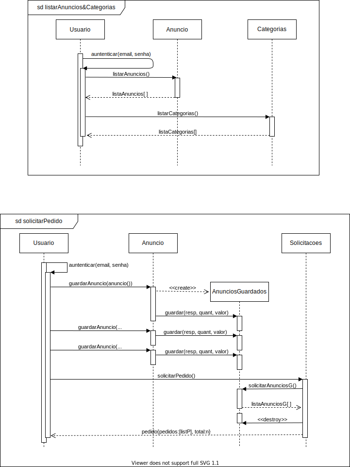
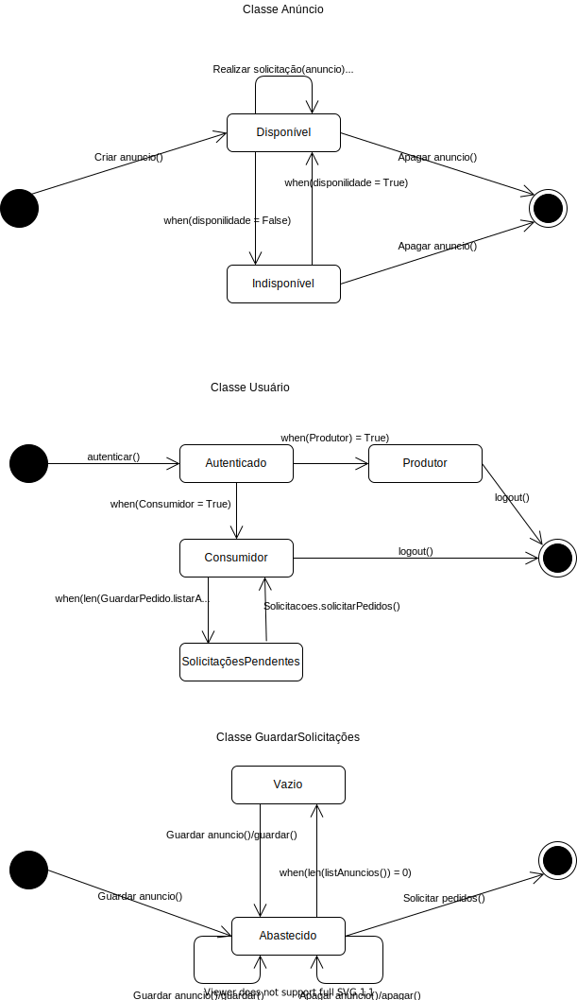

# Car Shop Services
O Car Shop Services é um projeto desenvolvido junto a disciplina Projeto e Desenvolvimento de Software (PDS), que visa criar uma aplicação WEB para a realização e oferecimento de itens e serviços do ramo automotivo, buscando melhorar e facilitar a demanda dos usuários especialistas na área ou até mesmo dos que desejam apenas uma rápida troca dos pneus.
## Diagrama de Casos de Uso

## Diagrama de Classes de Análise

## Diagrama de Sequência

## Diagrama de Estados
